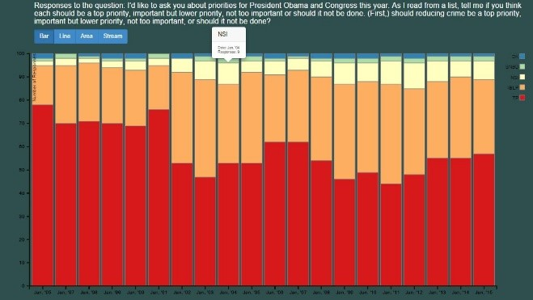
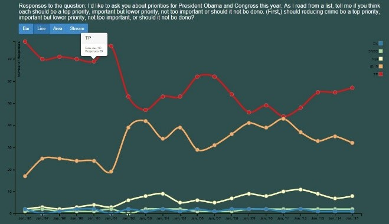
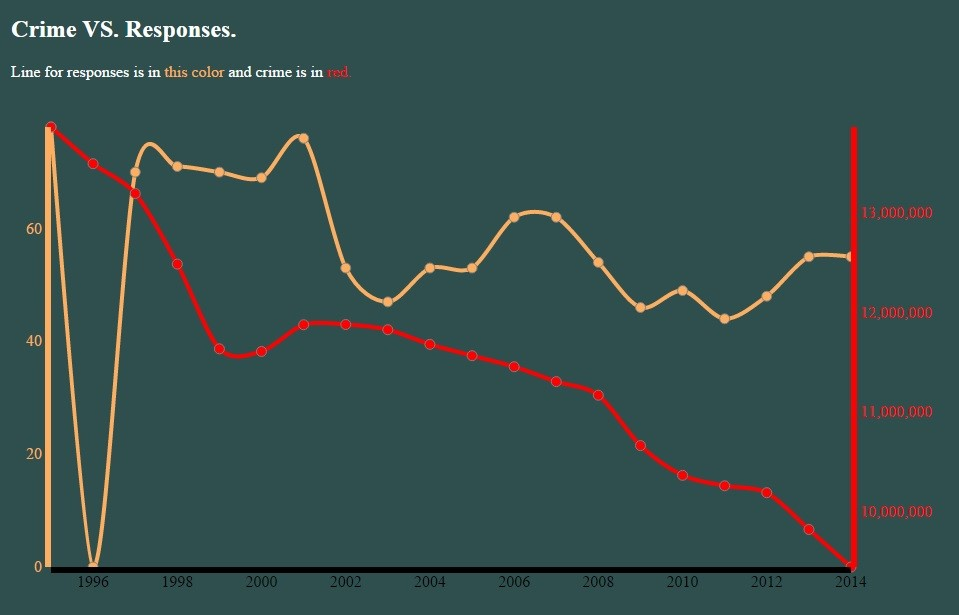
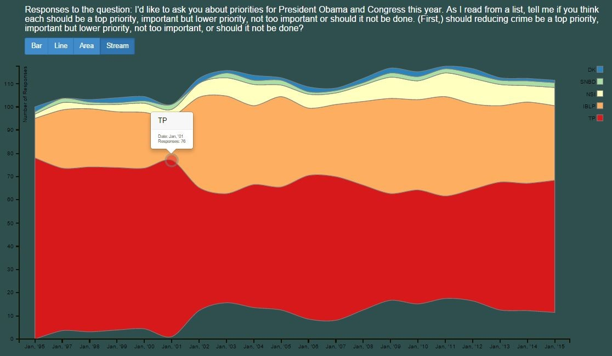
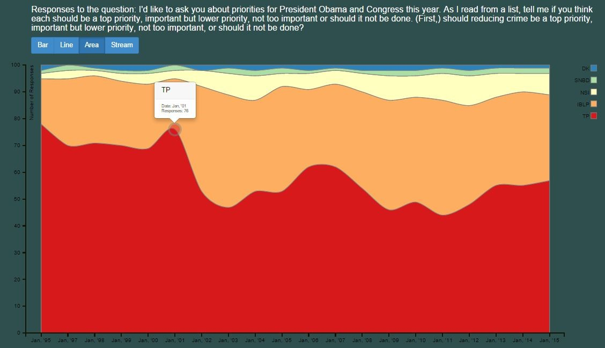

# CS 5093 Crime Analysis (Fall 2015)
Use D3.js to look at the crime statistics through the years using publicly available FBI crime statistics.

Made various visualizations usigng D3.js to look at the public perception towards crime trends for the years as collected by Pew Research Center through polling, crime vs population, crime vs public perception.

Different responses possible:

* Top priority (TP)

* Important but lower priority (IBLP)

* Not too important (NSI)

* Should not be done (SNBD)

* Don't know/Refused (DK)

## Screenshots

